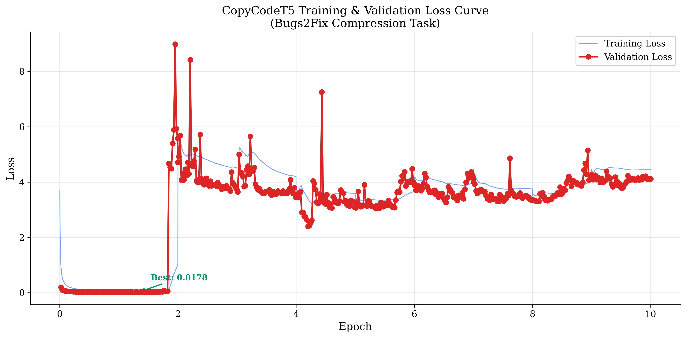
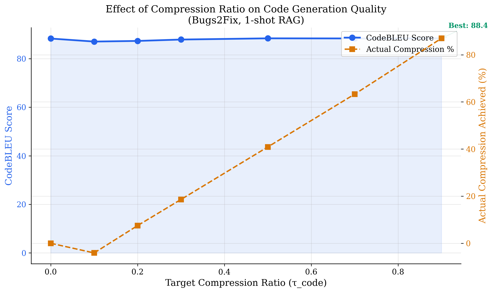
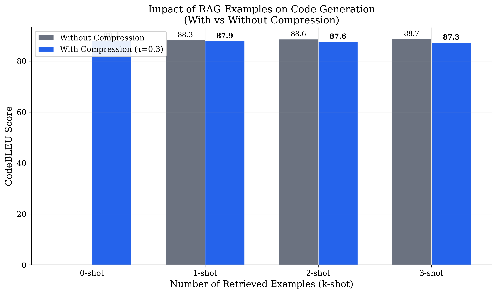
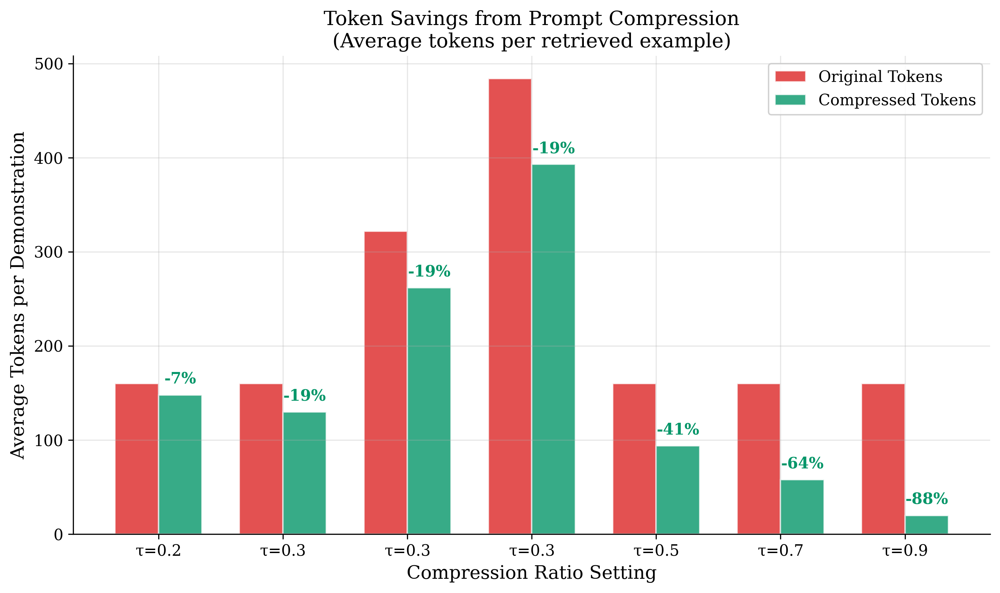
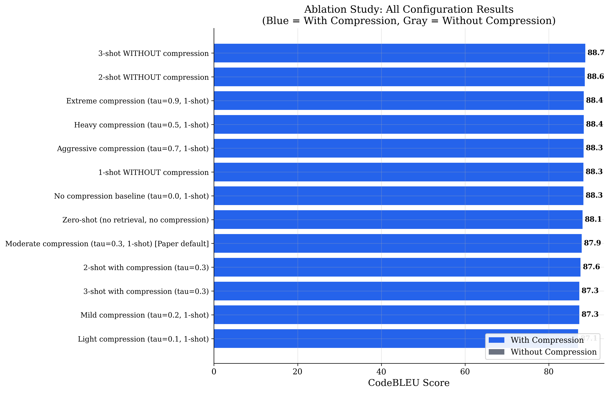

<p align="center">
  
</p>

<h3 align="center">Code-Specific Prompt Compression for<br/>Retrieval-Augmented Generation in Bug Fixing</h3>

<p align="center">
  <a href="https://arxiv.org/abs/2502.14925"></a>&nbsp;
  <a href="#-pretrained-model"></a>&nbsp;
  <a href="https://github.com/microsoft/CodeXGLUE"></a>&nbsp;
  &nbsp;
  
</p>

<p align="center">
  <em>Compress code demonstrations by up to <strong>87%</strong> with near-zero quality loss</em>
</p>

---

A reproduction and extension of the **CodePromptZip** framework ([He et al., 2025](https://arxiv.org/abs/2502.14925)), implementing a complete pipeline for **code-specific prompt compression** applied to the **Bugs2Fix** task from the [Microsoft CodeXGLUE](https://github.com/microsoft/CodeXGLUE) benchmark. The system compresses retrieved code demonstrations by up to **87%** while preserving downstream bug-fixing quality, using a **Copy-Enhanced CodeT5** compressor and **CodeLlama-34B** as the base language model.

> **Authors:** Ansh Gupta (IMT2023540) · Mayank Tanwar (IMT2023012) · Prakrititz Borah (IMT2023547) · Kunal Jindal (IMT2023049)
>
> **Course:** NLP + Deep Learning Project, IIIT Bangalore, April 2026

<br/>

## 📑 Table of Contents

<details>
<summary><strong>Click to expand</strong></summary>

- [🎯 Problem Statement](#-problem-statement)
- [🏗️ Architecture Overview](#️-architecture-overview)
- [🔧 Key Technical Components](#-key-technical-components)
- [📂 Project Structure](#-project-structure)
- [⚡ Setup & Installation](#-setup--installation)
- [🚀 Execution Flow](#-execution-flow)
- [⚙️ Training Configuration](#️-training-configuration)
- [📊 Results](#-results)
- [🔬 Differences from the Original Paper](#-differences-from-the-original-paper)
- [🤗 Pretrained Model](#-pretrained-model)
- [📚 References](#-references)

</details>

<br/>

## 🎯 Problem Statement

Modern LLM-based code repair pipelines use **Retrieval-Augmented Generation (RAG)**: before asking the model to fix a bug, similar buggy–fixed code pairs are retrieved from a knowledge base and placed into the prompt as demonstrations. While effective, this creates two critical bottlenecks:

> **1. Context window limits** — Retrieved examples containing full buggy and fixed methods consume thousands of tokens, often exceeding the LLM's context window.
>
> **2. High inference cost** — Proprietary APIs charge per token, making bloated prompts prohibitively expensive.

Existing prompt compression methods (LLMLingua, RECOMP, LLMLingua-2) were designed for **natural language** and fail on code because they do not consider the **syntactic role** of tokens. An entropy-based approach might discard a method invocation like `.getInstance()` because its sub-tokens are predictable, even though it is semantically critical for understanding a bug.

**CodePromptZip** addresses this gap by introducing a **code-specific prompt compression framework** that leverages program analysis to understand which tokens are safe to remove for a given downstream task.

<br/>

## 🏗️ Architecture Overview

The framework operates in two **fully decoupled** phases — the compressor and the base LM share no gradients or embeddings.

### Training Phase

```
╭─────────────────╮     ╭──────────────────╮     ╭──────────────────╮     ╭───────────────────╮     ╭─────────────────────╮
│  Knowledge Base │     │ Program Analysis │     │ Ablation Analysis│     │  Priority-Driven  │     │   Fine-tune         │
│  52,364 pairs   │────▸│ (JavaParser/AST) │────▸│ (Token Priority  │────▸│  Greedy Algorithm │────▸│   Copy-Enhanced     │
│  (Bugs2Fix)     │     │                  │     │  Ranking)        │     │  (9 ratios)       │     │   CodeT5-large      │
╰─────────────────╯     ╰──────────────────╯     ╰──────────────────╯     ╰───────────────────╯     ╰─────────────────────╯
```

### Inference Phase

```
╭──────────────╮     ╭───────────────╮     ╭────────────────╮     ╭──────────────────╮     ╭──────────────╮
│  New Buggy   │     │ BM25 Retriever│     │    LM_C        │     │    Base LM       │     │  Generated   │
│  Query       │────▸│ (top-k similar│────▸│  Compressor    │────▸│  CodeLlama-34B   │────▸│  Fix         │
│              │     │  pairs)       │     │  (target τ)    │     │  (Q4 quantized)  │     │              │
╰──────────────╯     ╰───────────────╯     ╰────────────────╯     ╰──────────────────╯     ╰──────────────╯
```

<br/>

## 🔧 Key Technical Components

### 1. Type-Aware Priority Ranking

Using **JavaParser** to construct Abstract Syntax Trees (ASTs), every token is categorized into one of five types:

| Token Type | Definition | Example |
| :---: | --- | --- |
| 🔣 **Symbol** | Operators, delimiters, punctuation | `=`, `{`, `;` |
| 📝 **Signature** | Method declaration and parameters | `public static void init(...)` |
| 📞 **Invocation** | Function/method calls | `Calendar.getInstance()` |
| 🏷️ **Identifier** | Variable names, class names | `VAR_1`, `TYPE_1` |
| 🔀 **Structure** | Control-flow keywords | `if`, `for`, `return` |

The removal priority is computed as:

```
Priority(T) = τ_code/T / d_T
```

where `τ_code/T` is the compression ratio achieved by removing all tokens of type T, and `d_T` is the resulting CodeBLEU degradation.

**Bugs2Fix Priority Ranking:**

```
🏷️ Identifier  ▸  📞 Invocation  ▸  🔀 Structure  ▸  🔣 Symbol  ▸  📝 Signature
  (remove first)                                                      (remove last)
```

---

### 2. Priority-Driven Greedy Compression

For each parsable code example, the greedy algorithm:

1. Assigns each token a removal priority based on its type and within-type frequency
2. Computes `L_rm = ⌊τ_code × L⌋` — the number of tokens to remove
3. Iteratively removes the highest-priority tokens until the budget is exhausted
4. Returns the compressed code as the training target

This is repeated for **9 compression ratios** (`τ_code ∈ {0.1, 0.2, ..., 0.9}`):

| Component | Count |
| :--- | ---: |
| Raw Bugs2Fix pairs | 52,364 |
| Compression ratios per example | 9 |
| **Total compression triples** | **471,276** |
| Training split (80%) | 377,020 |
| Validation split (10%) | 47,128 |
| Test split (10%) | 47,128 |

> ⚠️ The split is performed at the **code-example level** (not at the triple level) to prevent data leakage — all 9 compressed versions of the same code example are assigned to the same split.

---

### 3. Copy-Enhanced CodeT5 Compressor

The compressor is built on **CodeT5-large** (Salesforce, 770M parameters), an encoder-decoder transformer pre-trained on 8.35M code functions across 8 programming languages.

<details>
<summary><strong>Modification 1 — Extended Vocabulary</strong></summary>

Special tokens are added to signal the task and compression ratio:

```
<BUGS2FIX> <Ratio> 0.3 </Ratio> <Compress> {code} </Compress>
```

This enables the same model to be steered to different compression levels at inference time.

</details>

<details>
<summary><strong>Modification 2 — Copy Mechanism (Pointer-Generator)</strong></summary>

At each decoding step *t*:

1. The decoder produces cross-attention weights **a**ᵗ over source positions
2. A context vector is computed: **h**\*_t = Σᵢ aᵗᵢ · **h**ᵢ
3. A generation gate is computed: `p_gen = σ(W_gen · [h*_t, s_t] + b_gen)`
4. The copy distribution sums attention over matching source tokens: `P_copy(y) = Σ_{i: xᵢ = y} aᵗᵢ`
5. The final distribution blends vocabulary and copy:

```
P(y) = p_gen · P_vocab(y) + (1 - p_gen) · P_copy(y)
```

This ensures the compressed output is drawn **strictly from the input tokens**, preventing hallucinated code.

</details>

<br/>

## 📂 Project Structure

```
CodePromptZip/
│
├── 📁 configs/
│   └── config.yaml                 # All hyperparameters and settings
│
├── 📁 data/
│   └── download_datasets.py        # Download Bugs2Fix from HuggingFace
│
├── 📁 src/
│   ├── 📁 model/
│   │   ├── copy_codet5.py          # CopyCodeT5: CodeT5 + Copy Mechanism
│   │   └── copy_module.py          # Pointer-Generator Copy Module
│   ├── 📁 metrics/
│   │   ├── codebleu_metric.py      # CodeBLEU metric wrapper
│   │   └── exact_match.py          # Exact Match metric
│   ├── type_analysis.py            # JavaParser AST token categorization
│   ├── priority_ranking.py         # Priority-driven greedy algorithm
│   ├── dataset_construction.py     # Multi-ratio compression dataset builder
│   ├── tokenizer_utils.py          # Extended tokenizer with special tokens
│   ├── compress.py                 # Neural compressor inference
│   ├── retrieval.py                # BM25 retriever + RAG prompt formatting
│   ├── train.py                    # Training loop (FP16 + grad checkpointing)
│   └── evaluate.py                 # Full evaluation pipeline
│
├── 📁 scripts/
│   ├── run_all_evaluations.py      # Batch eval across all configurations
│   ├── plot_results.py             # Generate result plots and tables
│   ├── run_quick_test.py           # Quick sanity check
│   ├── run_train_compressor.py     # Training launcher
│   └── run_compress_and_eval.py    # Compression + eval launcher
│
├── 📁 results/
│   └── 📁 plots/                   # Generated visualizations
│
├── demo_viva.py                    # Interactive step-by-step demo
├── setup_env.sh                    # One-command environment setup (Linux)
├── requirements.txt                # Python dependencies
└── EXECUTION_FLOW.md               # Detailed execution guide
```

<br/>

## ⚡ Setup & Installation

### Prerequisites

| Requirement | Specification |
| :--- | :--- |
| **OS** | Linux (Ubuntu 20.04+) |
| **GPU** | NVIDIA GPU ≥24 GB VRAM (e.g., RTX 4090) |
| **CUDA** | 12.1+ with compatible drivers |
| **Python** | 3.12 |
| **Model** | `codellama-34b-instruct.Q4_K_M.gguf` (~20 GB) in project root |

### Quick Start

```bash
# 1. Clone the repository
git clone https://github.com/prakrititz/Token-PruningNLP.git
cd Token-PruningNLP

# 2. Run the automated setup script
chmod +x setup_env.sh
bash setup_env.sh

# 3. Activate the virtual environment
source venv/bin/activate

# 4. Download the Bugs2Fix dataset
python data/download_datasets.py --task bugs2fix

# 5. Verify GPU is detected
python -c "import torch; print(f'CUDA: {torch.cuda.is_available()}, GPU: {torch.cuda.get_device_name(0)}')"
```

<details>
<summary>What does <code>setup_env.sh</code> do?</summary>

- ✅ Checks for / installs Python 3.12 via deadsnakes PPA
- ✅ Creates a virtual environment (`./venv`)
- ✅ Installs all dependencies from `requirements.txt`
- ✅ Creates required project directories
- ✅ Verifies the installation (CUDA, GPU, packages)

</details>

<br/>

## 🚀 Execution Flow

### Step 1: Download Dataset

```bash
python data/download_datasets.py --task bugs2fix
```

Downloads **52,364 train / 6,546 val / 6,545 test** buggy–fixed Java code pairs into `data/raw/bugs2fix/`.

---

### Step 2: Construct Compression Dataset

```bash
python src/dataset_construction.py --config configs/config.yaml
```

Produces **471,276 compression triples** (52,364 × 9 ratios) split into train/val/test at the example level → `data/compression_dataset/`.

---

### Step 3: Train the Compressor

```bash
python src/train.py --config configs/config.yaml
```

The best checkpoint (lowest validation loss) is auto-saved to `checkpoints/best_model/`.

---

### Step 4: Run Evaluation Suite

```bash
# Full evaluation (2000 samples × 13 experiments)
python scripts/run_all_evaluations.py \
    --config configs/config.yaml \
    --checkpoint ./checkpoints/best_model \
    --max_eval_samples 2000

# Resume after interruption
python scripts/run_all_evaluations.py \
    --config configs/config.yaml \
    --checkpoint ./checkpoints/best_model \
    --max_eval_samples 2000 \
    --skip_existing
```

---

### Step 5: Plot Results

```bash
python scripts/plot_results.py
```

---

### Step 6: Interactive Demo

```bash
python demo_viva.py                  # Full pipeline with CodeLlama
python demo_viva.py --no_codellama   # Skip CodeLlama (retrieval + compression only)
python demo_viva.py --no_compressor  # Use greedy algorithm instead of neural compressor
```

<br/>

## ⚙️ Training Configuration

All hyperparameters are defined in [`configs/config.yaml`](configs/config.yaml).

| Hyperparameter | Value |
| :--- | :--- |
| Base Compressor Model | `Salesforce/codet5-large` (770M params) |
| Copy Mechanism | ✅ Enabled (Pointer-Generator) |
| Micro Batch Size | 8 |
| Gradient Accumulation Steps | 4 |
| **Effective Batch Size** | **32** |
| Learning Rate | 5 × 10⁻⁵ |
| Weight Decay | 0.01 |
| Warmup Steps | 500 |
| Number of Epochs | 10 |
| Mixed Precision | FP16 (`torch.amp`) |
| Gradient Checkpointing | ✅ Enabled |
| Max Source/Target Length | 512 tokens |
| Seed | 42 |

| Evaluation Setting | Value |
| :--- | :--- |
| Base LM | CodeLlama-34B-Instruct (Q4_K_M, GGUF) |
| Context Window | 8,192 tokens |
| Temperature | 0.0 (deterministic) |
| Metric | CodeBLEU |

### Training Curve

<p align="center">
  
</p>

<p align="center"><em>CopyCodeT5 Training & Validation Loss across 10 epochs. Best validation loss: <strong>0.0178</strong> (achieved at ~epoch 2).</em></p>

<br/>

## 📊 Results

> All results below are from **2,000 evaluation samples** (seed=42) using the trained CodeT5-large compressor and **CodeLlama-34B-Instruct** (Q4_K_M quantized) as the base LM.

---

### Experiment 1: Compression Ratio Sweep (1-shot)

Sweep `τ_code` from 0.0 (no compression) to 0.9 (extreme compression) with `num_shots = 1`.

| τ_code | Actual Compression | Avg Tokens | CodeBLEU (%) | Syntax (%) | Dataflow (%) |
| :----: | :----------------: | :--------: | :----------: | :--------: | :----------: |
| 0.0 | 0% *(baseline)* | 160 → 160 | **88.30** | 84.52 | 86.36 |
| 0.1 | −4.1% *(expansion)* | 160 → 167 | 87.05 | 82.66 | 84.46 |
| 0.2 | 7.5% | 160 → 148 | 87.32 | 82.80 | 85.12 |
| 0.3 | 18.6% | 160 → 130 | 87.89 | 83.80 | 85.59 |
| **0.5** | **40.9%** | **160 → 94** | **88.38** | 84.09 | 86.62 |
| 0.7 | 63.3% | 160 → 58 | 88.34 | 84.14 | 86.42 |
| **0.9** | **87.0%** | **160 → 20** | **88.39** | 84.13 | 86.55 |

<p align="center">
  
</p>

<p align="center"><em>CodeBLEU remains remarkably stable across all compression levels. Even at 87% compression (τ=0.9), quality is virtually identical to the uncompressed baseline.</em></p>

---

### Experiment 2: Multi-Shot Ablation (τ = 0.3)

Fix `τ_code = 0.3` and vary the number of retrieved demonstrations.

| Shots | Compression | Avg Tokens | CodeBLEU (%) |
| :---: | :---------: | :--------: | :----------: |
| 0 *(zero-shot)* | N/A | — | 88.10 |
| 1 | 18.6% | 160 → 130 | 87.89 |
| 2 | 18.7% | 322 → 262 | 87.62 |
| 3 | 18.7% | 484 → 393 | 87.33 |

<p align="center">
  
</p>

<p align="center"><em>With compression (blue), performance degrades gracefully from 1-shot to 3-shot. Without compression (gray), it slightly improves.</em></p>

---

### Experiment 3: Uncompressed Baselines

Evaluate uncompressed demonstrations at multiple shot counts to isolate the effect of compression vs. retrieval.

| Shots | CodeBLEU (%) | Syntax (%) | Dataflow (%) |
| :---: | :----------: | :--------: | :----------: |
| 1 | 88.31 | 84.52 | 86.41 |
| 2 | 88.62 | 84.74 | 86.75 |
| 3 | **88.74** | 84.96 | 86.88 |

---

### Token Savings Visualization

<p align="center">
  
</p>

<p align="center"><em>Original vs. compressed token counts across configurations. At τ=0.9, demonstrations shrink from 160 to just 20 tokens — an <strong>88% reduction</strong>.</em></p>

---

### Complete Ablation Summary

<p align="center">
  
</p>

<p align="center"><em>All 13 experimental configurations ranked by CodeBLEU. The narrow spread (87.1–88.7) demonstrates the robustness of both the compressor and CodeLlama-34B.</em></p>

---

### 🔑 Key Findings

1. **Non-monotonic compression curve** — CodeBLEU does not degrade linearly with compression. After an initial dip at low τ (0.1–0.3), performance **recovers** at higher compression (0.5–0.9). At τ = 0.5, the compressor achieves **40.9% token reduction** with a **0.08% CodeBLEU improvement** over the uncompressed baseline (88.38 vs. 88.30).

2. **Extreme compression robustness** — Even at τ = 0.9 (87% token reduction, 160 → 20 tokens), CodeBLEU remains at **88.39** — essentially identical to the uncompressed baseline. This demonstrates that CodeLlama-34B is highly robust to compressed demonstrations.

3. **τ = 0.1 expansion anomaly** — At τ = 0.1, the compressor actually *increases* the token count (160 → 167). The CodeT5 decoder generates tokens auto-regressively, and at very low compression targets, it may reproduce the input with minor additions.

4. **Graceful multi-shot degradation** — With compression at τ = 0.3, performance degrades gracefully from 1-shot (87.89) to 3-shot (87.33), a mild 0.56% drop. Without compression, performance slightly improves with more shots (88.31 → 88.74).

5. **Strong zero-shot baseline** — Zero-shot achieves 88.10 CodeBLEU, indicating CodeLlama-34B is already highly capable at bug fixing without demonstrations.

<br/>

## 🔬 Differences from the Original Paper

| Aspect | Original Paper | Our Implementation |
| :--- | :--- | :--- |
| Base LM | GPT-3.5-turbo, Gemini-1.0 | CodeLlama-34B-Instruct (Q4_K_M, local) |
| CodeT5 Variant | CodeT5-large (770M) | CodeT5-large (770M) |
| Training Epochs | 10 | 10 |
| Training Data | 48,903 parsable × 9 = 440K | 52,364 total × 9 = 471K |
| Eval Samples | Full test set (6,545) | 2,000 samples |
| GPU | Not specified | NVIDIA RTX 4090 (24 GB VRAM) |

<br/>

## 🤗 Pretrained Model

The trained Copy-Enhanced CodeT5-large compressor checkpoint is available on HuggingFace:

> 🤗 **[HuggingFace Model Hub — Coming Soon](#)**
>
> *The model will be uploaded to HuggingFace and the link will be updated here.*

**Quick usage:**

```python
from src.compress import CodeCompressor

compressor = CodeCompressor("./checkpoints/best_model")  # or HuggingFace model ID
compressed = compressor.compress(
    "public int add(int a, int b) { return a - b; }",
    tau_code=0.3,
    task="bugs2fix"
)
print(compressed)
```

<br/>

## 📚 References

| # | Reference |
| :---: | :--- |
| 1 | P. He, S. Wang, T.-H. Chen — *"CodePromptZip: Code-Specific Prompt Compression for RAG in Coding Tasks with LMs"*, 2025. [arXiv:2502.14925](https://arxiv.org/abs/2502.14925) |
| 2 | Y. Wang et al. — *"CodeT5: Identifier-aware Unified Pre-trained Encoder-Decoder Models for Code Understanding and Generation"*, EMNLP 2021 |
| 3 | S. Lu et al. — *"CodeXGLUE: A Machine Learning Benchmark Dataset for Code Understanding and Generation"*, NeurIPS 2021. [GitHub](https://github.com/microsoft/CodeXGLUE) |
| 4 | B. Rozière et al. — *"Code Llama: Open Foundation Models for Code"*, Meta AI, 2023 |
| 5 | S. Ren et al. — *"CodeBLEU: a Method for Automatic Evaluation of Code Synthesis"*, 2020 |

---

<p align="center">
  <sub>Built with ❤️ at IIIT Bangalore</sub>
</p>
